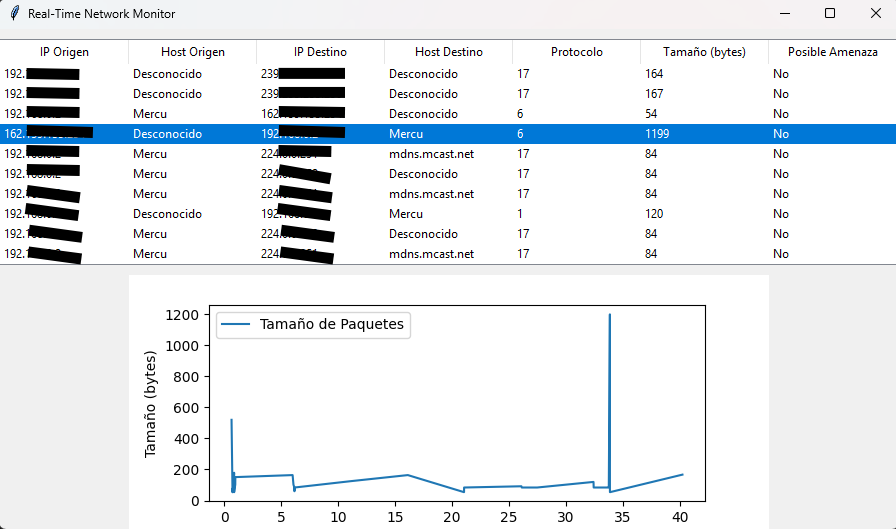

# Real-Time Network Monitor

## 📌 Descripción
Real-Time Network Monitor es una herramienta avanzada para la captura y análisis de tráfico de red en tiempo real. Su interfaz intuitiva permite monitorear paquetes de datos, identificar dispositivos conectados y detectar posibles amenazas en la red. Ideal para administradores de sistemas y entusiastas de la ciberseguridad.

## 🚀 Características
- Captura paquetes en tiempo real.
- Muestra IP de origen, destino, protocolo y tamaño de cada paquete.
- Identifica dispositivos conectados y muestra su nombre (si está disponible).
- Detecta IPs sospechosas y posibles amenazas en la red.
- Gráfico en vivo del tráfico de red.
- Interfaz gráfica intuitiva con Tkinter y Matplotlib.

## 🛠️ Instalación
### 1️⃣ Requisitos previos
- **Python 3.7+**
- **Npcap (solo en Windows)** ➝ [Descargar aquí](https://npcap.com)

### 2️⃣ Instalar dependencias
Ejecuta el siguiente comando:
```bash
pip install scapy matplotlib tk
```

### 3️⃣ Ejecutar el programa
Guarda el código en `network_monitor.py` y ejecútalo con:
```bash
python network_monitor.py
```

## ⚙️ Uso
1. Inicia el programa.
2. Se mostrará una tabla con los paquetes capturados en tiempo real.
3. Observa la información del dispositivo y si es una posible amenaza.
4. Visualiza el gráfico con el tamaño de los paquetes a lo largo del tiempo.

## 🖥️ Capturas de pantalla


## 🛡️ Advertencia
Este software está diseñado **exclusivamente** para **propósitos educativos y de monitoreo en redes propias**. **No lo uses en redes sin permiso**, ya que puede infringir leyes de privacidad y ciberseguridad.

## 📜 Licencia
Este proyecto está bajo la licencia MIT. Puedes usarlo y modificarlo libremente.

## 📩 Contribuciones
Si deseas mejorar el proyecto, ¡las contribuciones son bienvenidas! Haz un **fork**, realiza tus cambios y envía un **pull request**.

## 📝 Autor
- **[MercuGmes]**  
  🚀 GitHub: [MercuGmes]  

